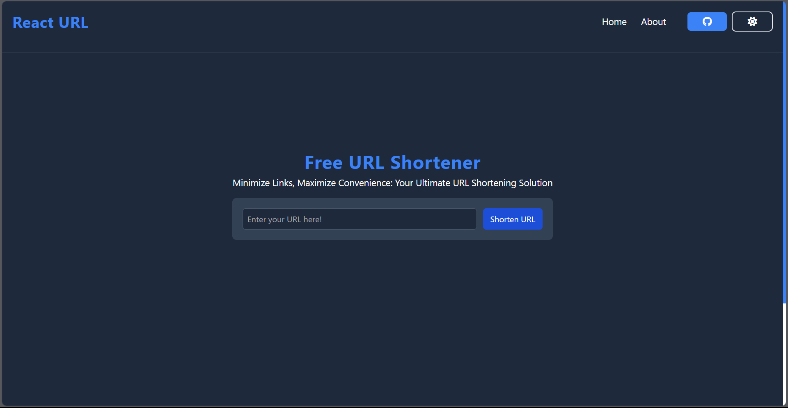

<h1 align="center">
     🔗 <a href="" alt="React URL"> React URL</a>
</h1>

<p align="center">
  

  
  
  <a href="https://github.com/ovasconcelos/url-shortener/commits/master">
    
  </a>
    
   
   
   <a href="https://github.com/ovasconceloss/url-shortener/stargazers">
    
  </a> 
</p>

<hr>



<hr>

## 💻 About

This is a link shortener developed with ReactJS and Tailwind. It provides a simple and effective way to shorten long URLs, making sharing and managing links easier. This project was created with the aim of providing a useful and intuitive tool to simplify link sharing on the web.

---

## ⚙️ Features

- [x] The user can shorten any type of URL
- [x] The user can shorten as many URLs as they like
- [x] The user can choose between a light and dark theme
- [ ] The user can see old links that have been shortened
- [ ] The user can create an account and log on to the platform

---

## 🚀 Get Started

### Prerequisites

Before you begin, you will need to have the following tools installed on your machine: [Git](https://git-scm.com) and [Node.js](https://nodejs.org/en/). 

#### 🧭 Running Application

```bash

# Clone this repository
$ git clone https://github.com/OVasconceloss/url-shortener.git

# Access the project folder in your terminal/cmd
$ cd react-shortener

# Install the dependencies
$ npm install

# Run the application in development mode
$ npm run dev

# The application will be opened on port:5173 - go to http://localhost:5173

```

---

## 🛠 Technologies

#### **Website**  ([React](https://reactjs.org/)  +  [Tailwind CSS](https://tailwindcss.com/docs/installation))

-   **[Axios](https://github.com/axios/axios)**
-   **[Dotenv](https://www.npmjs.com/package/dotenv)**
-   **[FontAwesome](https://fontawesome.com/v5/docs/web/use-with/react)**
-   **[React Router Dom](https://github.com/ReactTraining/react-router/tree/master/packages/react-router-dom)**

> See the file [package.json](./package.json)

#### [](https://github.com/tgmarinho/Ecoleta#utilit%C3%A1rios)**Utilities**

-   API:  **[Bitly API](https://dev.bitly.com/)**
-   Icons: **[Font Awesome](https://fontawesome.com/)**
-   Editor:  **[Visual Studio Code](https://code.visualstudio.com/)**
-   Commit Conventional:  **[Conventional Commits](https://www.conventionalcommits.org/en/v1.0.0/)**


---
## 💪 How to Contribute

1. Make a **fork** of the project.
2. Create a new branch with your changes: `git checkout -b my-feature`
3. Save the changes and create a commit message: `git commit -m "feature: My new feature"`
4. Send your changes: `git push origin my-feature`

---

## 📝 License

This project is under license [MIT](./LICENSE).

---